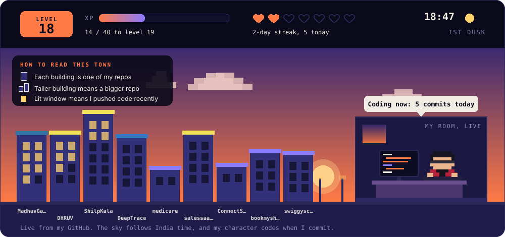

  

 

Click, press <b>Submit new issue</b>, and wait about a minute. Then refresh this page.

  

## What I'm up to

I'm learning data structures and algorithms, building projects in Java and Python, and getting comfortable with backend development.
I like breaking complex CS ideas into simple explanations, and I don't give up easily.

**Looking to collaborate on:** beginner-friendly open source, college tech projects, learning-focused hackathons.
**Looking for help with:** optimizing DSA solutions, system design basics, clean code habits.
**Ask me about:** MongoDB basics, Java fundamentals, the MERN stack.

### Shipping, one square at a time

 

  

`while (!giveUp) { learn(); build(); ship(); }`

